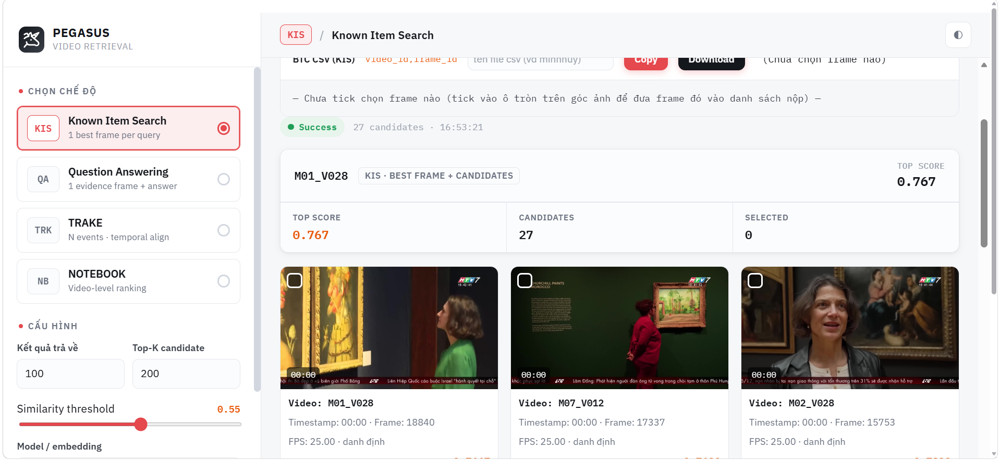

# AIC 2026 Video Retrieval

[](https://www.python.org/)
[](#-ki%E1%BB%83m-th%E1%BB%B1)
[](LICENSE)

> Hệ thống retrieval video cho giải **AIC 2026** — hỗ trợ 3 task: **KIS**, **Q&A**, **TRAKE**.
> Dense retrieval bằng **SigLIP2 + FAISS**, lexical bằng **BM25**, điều phối bằng **LLM cục bộ (Ollama)**.

<!-- ▼▼▼ Thả ảnh UI vào docs/images/ ▼▼▼ -->
**Query demo (KIS):**
> A short-haired woman wearing a green shirt is looking at the painting on the wall


<!-- ▲▲▲ ▲▲▲ -->

---

## 📋 Mục lục

- [Giới thiệu](#-gi%E1%BB%9Bi-thi%E1%BB%87u)
- [Kết quả](#-k%E1%BA%BFt-qu%E1%BA%A3)
- [Tech stack](#-tech-stack)
- [Cài đặt](#-c%C3%A0i-%C4%91%E1%BA%B7t)
- [Chạy bằng Docker](#-ch%E1%BA%A1y-b%E1%BA%B1ng-docker)
- [Chạy thử nhanh](#-ch%E1%BA%A1y-th%E1%BB%AD-nhanh)
- [Tham chiếu CLI](#-tham-chieu-cli)
- [Kiểm thử](#-ki%E1%BB%83m-th%E1%BB%B1)
- [Cấu trúc dự án](#-c%E1%BA%A5u-tr%C3%BAc-d%E1%BB%B1-%C3%A1n)

---

## 🎯 Giới thiệu

Dự án xử lý **3 task** của AIC 2026 trên bộ dữ liệu video tiếng Việt:

| Task | Mô tả | Đầu ra |
|------|--------|--------|
| **KIS** | Tìm 1 frame khớp truy vấn | `video_id, frame_id` |
| **Q&A** | Trả lời câu hỏi bằng VLM trên frame phù hợp | `video_id, frame_id, answer` |
| **TRAKE** | Căn hàng loạt frame theo thứ tự sự kiện | `video_id, frame_1, …, frame_N` |

<!-- ▼▼▼ Thả ảnh pipeline ▼▼▼ -->
<!--  -->
<!-- ▲▲▲ ▲▲▲ -->

**Điểm nổi bật:**

- **Hybrid retrieval**: dense (SigLIP2 768-dim + FAISS) + lexical (BM25) → RRF fusion
- **Cascade rerank**: object evidence → colour → late-interaction → adaptive fusion → Gemini (tắt mặc định)
- **Agent cục bộ**: Ollama qwen3:0.6b phân tích truy vấn, không cần cloud
- **API sẵn sàng**: FastAPI preload index khi khởi động, query < 2s

---

## 📊 Kết quả

### Kiểm thử tự động

```
266/278 tests passing (95.7%)
```

12 test còn lại là test phụ thuộc môi trường (Gemini API, Ollama, model checkpoint) — không phải lỗi code.

<!-- ▼▼▼ Thả ảnh dashboard ▼▼▼ -->
<!--  -->
<!-- ▲▲▲ ▲▲▲ -->

### Hiệu năng quan sát

| Thành phần | Thời gian | Ghi chú |
|------------|-----------|---------|
| Load index (SigLIP2 + FAISS + BM25) | ~20s | preload 1 lần khi khởi động API |
| KIS query | < 2s | sau khi index đã nạp |
| TRAKE query | ~3–8s | coarse filter top-200 video + DP |
| Embed toàn bộ keyframes (177k) | ~190s | batch, có resume |
| OCR toàn bộ keyframes | vài giờ | shard song song được |

---

## 🧩 Tech stack

| Hạng mục | Công nghệ |
|----------|-----------|
| **Ngôn ngữ** | Python 3.10+ |
| **Quản lý env** | [uv](https://github.com/astral-sh/uv) |
| **Dense retrieval** | SigLIP2 (`google/siglip2-base-patch16-224`, 768-dim) |
| **Fallback embedding** | OpenCLIP ViT-B/32 (512-dim) |
| **Vector index** | FAISS (IndexFlatIP), ChromaDB (tùy chọn) |
| **Lexical** | BM25 tự viết (Unicode/Vietnamese tokenizer) |
| **LLM cục bộ** | Ollama (qwen3:0.6b, qwen2.5:1.5b) |
| **VLM (Q&A)** | Florence-2 (`microsoft/Florence-2-base-ft`) |
| **OCR** | PaddleOCR (vi/en, PP-OCRv6) |
| **API** | FastAPI + Uvicorn |
| **CLI** | Typer |
| **Schema** | Pydantic v2 |
| **Đánh giá** | Recall@k, MRR (custom) |

---

## 🛠️ Cài đặt

### Yêu cầu

- Python 3.10+, [uv](https://docs.astral.sh/uv/getting-started/installation/)
- (Tuỳ chọn) [Ollama](https://ollama.com/) — chỉ khi bật LLM planner; **không bắt buộc** cho KIS/QA/TRAKE core
- (Tuỳ chọn) [Docker](https://docs.docker.com/get-docker/) — xem [Chạy bằng Docker](#-ch%E1%BA%A1y-b%E1%BA%B1ng-docker)

### Cài đặt nhanh

```bash
git clone https://github.com/<ten-ban>/AIC2026.git
cd AIC2026
uv sync --extra models --extra retrieval --extra video
```

---

## 🐳 Chạy bằng Docker

Không muốn cài Python/uv/FAISS/torch trên máy? Dùng Docker — image đã bao runtime, data mount volume.

### Chuẩn bị

```bash
# 1. Đảm bảo Docker Desktop đang chạy
docker version

# 2. (Tuỳ chọn) copy env mẫu
cp .env.example .env
```

**Yêu cầu dữ liệu:** API preload index khi khởi động. Cần có sẵn trong `data/processed/`:

| File | Vai trò |
|------|---------|
| `siglip2/manifest_siglip2.jsonl` | Manifest frame |
| `siglip2/features_siglip2.npy` | Vector SigLIP2 |
| `siglip2/index_ivfpq.faiss` | FAISS IVFPQ (nếu dùng) |
| `video_metadata.jsonl` | Metadata video |
| Keyframes trong `data/raw/...` hoặc path manifest trỏ tới | Ảnh cho QA/VLM |

Nếu thiếu, chạy offline trước (uv mode) rồi `docker compose up`.

### Chạy API + UI

```bash
docker compose up --build
```

Lệnh đầu tiên build image (~vài phút đến ~10 phút tuỳ mạng) rồi start 2 service:

| Service | Cổng | URL |
|---------|------|-----|
| **api** (FastAPI) | 8000 | http://127.0.0.1:8000 · http://127.0.0.1:8000/health |
| **ui** (Streamlit PEGASUS) | 8501 | http://127.0.0.1:8501 |

```bash
# Kiểm tra health (chờ ~20–90s lần đầu vì preload SigLIP2 + FAISS + BM25)
curl http://127.0.0.1:8000/health

# Dừng (giữ volume/data)
docker compose down

# Dừng + xoá volume HF cache (phải embed lại model)
docker compose down -v
```

### Ollama (tuỳ chọn — mặc định TẮT)

Hệ thống **không bắt buộc LLM**. Chỉ thêm khi muốn planner/verifier LLM:

```bash
docker compose --profile llm up -d
docker exec -it aic2026-ollama ollama pull qwen3.5:4b
# Trong UI/API set ollama_url = http://127.0.0.1:11434
```

### Volume & dữ liệu

```text
./data        → /app/data        (bind mount: manifest, FAISS, keyframes)
./outputs     → /app/outputs     (kết quả)
hf-cache      → ~/.cache/huggingface  (named volume: weights SigLIP2/Florence)
```

- **Bind mount** (`./data`): thấy ngay trên host, sửa file là container đọc theo.
- **Named volume** (`hf-cache`): Docker quản lý, model không bị mất khi `down`, không phình image.

### Đổi sang GPU (khi host có NVIDIA)

Docker **không có GPU free** — GPU phải là card vật lý của máy + [NVIDIA Container Toolkit](https://docs.nvidia.com/datacenter/cloud-native/container-toolkit/latest/install-guide.html).

```bash
# Build image CUDA (thay base)
docker build --build-arg BASE_IMAGE=nvidia/cuda:12.4.1-runtime-ubuntu22.04 -t aic2026:cuda .

# Chạy với GPU (compose: thêm deploy.resources.reservations.devices)
docker run --gpus all -p 8000:8000 -v "$PWD/data:/app/data" aic2026:cuda
```

Máy không GPU: cứ để mặc định `python:3.11-slim` + torch CPU.

### Troubleshooting

| Lỗi | Nguyên nhân | Cách sửa |
|------|-------------|----------|
| API start fail “heavy asset preload” | Thiếu `data/processed/siglip2/*` | Chạy embed/index offline trước |
| UI “Không kết nối backend” | API chưa healthy / sai backendUrl | Chờ `/health` ok; trong UI set `http://127.0.0.1:8000` |
| Build chậm / image to | Context gửi cả `data/`, `.venv/` | Kiểm tra `.dockerignore` |
| CORS error | UI gọi port khác | Browser phải mở `http://127.0.0.1:8501` (đúng origin CORS) |
| Model tải lại mỗi lần | HF cache không mount | Đảm bảo volume `hf-cache` có trong compose |

### Lý thuyết Docker tóm tắt

| Khái niệm | Trong dự án này |
|-----------|-----------------|
| **Image** | `aic2026:dev` — khuôn chứa Python + deps + source |
| **Container** | Tiến trình chạy từ image (api, ui) |
| **Layer / cache** | `COPY pyproject` → `RUN pip` → `COPY src` — sửa code không cài lại deps |
| **Build context** | Thư mục gửi lên daemon; `.dockerignore` cắt `data/`, `.venv/` |
| **Port map** | `8000:8000` = host:container |
| **Volume** | Data/model sống lâu hơn container lifecycle |
| **Compose service** | api + ui (+ ollama sau profile `llm`) |
| **Healthcheck** | `/health` — compose chờ API preload xong mới start UI |

### Chuẩn bị dữ liệu BTC

```bash
# 1. Xem data/raw hiện có gì
aic2026 inspect-data --raw-dir data/raw

# 2. Giải nén ZIP hỗ trợ BTC (map-keyframes, clip-features, ...)
aic2026 unpack-support-assets --archives-dir data/downloads --destination data/raw/support

# 3. Build manifest + features từ CLIP features chính thức
aic2026 prepare-official \
  --features data/raw/CLIP_features/L21_V001.npy \
  --raw-dir data/raw

# 4. (Tuỳ chọn) OCR enrich object_labels
aic2026 ocr-manifest --manifest data/processed/official_manifest.jsonl --lang vi
```

---

## 🚀 Chạy thử nhanh

```bash
# 1. Tạo file query
cat > query_kis.json <<'EOF'
{
  "query_id": "KIS_001",
  "type": "kis",
  "text": "người đàn ông mặc áo đỏ đang đi bộ trên đường phố"
}
EOF

# 2. Chạy agent
aic2026 agent-query --query query_kis.json --output outputs/result.json

# 3. Xuất CSV nộp bài BTC
aic2026 export-submission --result outputs/result.json --query query_kis.json
```

**Chạy API + UI:**

```bash
aic2026 serve --host 127.0.0.1 --port 8000   # Backend FastAPI
# UI Streamlit chạy riêng ở cổng 8501
```

<!-- ▼▼▼ Thả ảnh demo ▼▼▼ -->

<!-- ▲▲▲ ▲▲▲ -->

---

## 📖 Tham chiếu CLI

### Chuẩn bị dữ liệu

| Lệnh | Mô tả |
|------|--------|
| `inspect-data` | Kiểm tra 5 nhóm asset BTC |
| `unpack-support-assets` | Giải nén ZIP hỗ trợ |
| `prepare-official` | Build manifest + features từ CLIP BTC |
| `embed-keyframes` | Encode keyframe JPG sẵn có |
| `embed-siglip2` | Embed keyframes bằng SigLIP2 |
| `ocr-manifest` | OCR keyframe → `object_labels` |
| `compute-colour-features` | Precompute màu offline |

### Index

| Lệnh | Mô tả |
|------|--------|
| `build-chroma-index` | Build ChromaDB collection |
| `build-siglip2-index` | Build FAISS từ SigLIP2 |
| `validate-siglip2` | Validate artifacts |
| `benchmark-siglip2` | So sánh CLIP vs SigLIP2 |

### Retrieval & Agent

| Lệnh | Mô tả |
|------|--------|
| `agent-query` | Chạy agent KIS/QA/TRAKE |
| `export-submission` | JSON → CSV nộp bài |
| `evaluate` | Đánh giá R@k |
| `serve` | Khởi động FastAPI |

Xem chi tiết flags: `aic2026 <lệnh> --help`

---

## ✅ Kiểm thử

```bash
uv run pytest -v
uv run pytest tests/test_retrieval_pipeline.py -v   # 1 module
```

---

## 📁 Cấu trúc dự án

```
AIC2026/
├── src/aic2026/
│   ├── agent/          # RetrievalAgent + Ollama LLM + tools
│   ├── app/            # FastAPI service
│   ├── embeddings/     # SigLIP2, OpenCLIP encoders
│   ├── ingestion/      # Manifest, official index, OCR
│   ├── retrieval/      # VectorIndex, BM25, Pipeline
│   ├── reranking/      # Object/colour/late-interaction/fusion/Gemini
│   ├── qa/             # Florence-2 VLM, OCR
│   ├── query/          # QueryPlan, parser, expansion
│   ├── temporal/       # DP alignment (TRAKE)
│   ├── cli.py          # Toàn bộ CLI commands
│   └── models.py       # Pydantic schemas
├── tests/              # 52 test files
├── scripts/            # Script độc lập
└── data/               # Dữ liệu (gitignored)
```

---

## 📄 License

MIT — xem [LICENSE](LICENSE).

---

<p align="center">
  <sub>Built for AIC 2026 · <a href="#-m%E1%BB%A5c-l%E1%BB%A5c">Về đầu trang</a></sub>
</p>
